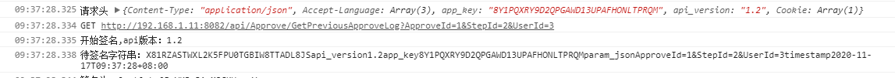
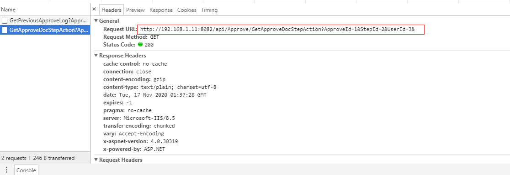
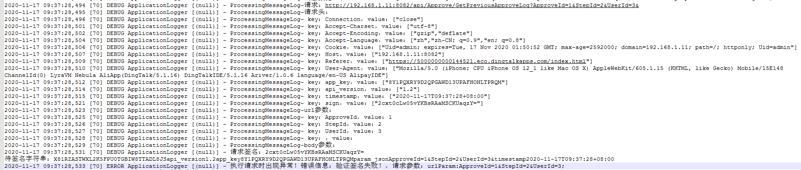

# 钉钉小程序踩坑记录-dd.httpRequest 含url参数的请求Url地址问题

钉钉Http请求在有url参数的情况下，会在url参数结尾添加一个`&`。由于我请求的服务需要对请求签名，导致服务端在验证签名时，获取到的请求请求参数字符串后也多了个`&`，导致验证签名失败。

钉钉请求代码：

```javascript
    var headers = {
        "Content-Type": "application/json",
        "Accept-Language":["zh","zh-CN; q=0.9","en; q=0.8"],
        "app_key":self.appKey,
        "api_version": self.apiVersion,
        "Cookie":getApp().UserCookie
      };

    console.log("请求头",headers)

    headers.timestamp=new Date().format("yyyy-MM-ddTHH:mm:sszzz");
    var url = BuildUriPath('http://'+self.serverHost+api,queryString);
    console.log(requestMethod,url);

    requestMethod = requestMethod.toUpperCase();
    var strBodyData="";
    switch(requestMethod){
      case "GET":
        strBodyData="";
        break;
      case "POST":
      case "DELETE":
      case "UPDATE":
        strBodyData=JSON.stringify(bodyData);
        strBodyData = self.encryptor(strBodyData);
        break;
      default:
        throw "未知的请求方法:"+requestMethod;
    }

    /**
        对请求签名
    **/
    // 取消此处注释，解决钉钉在http请求时在url参数后添加&符号，导致服务端验证签名失败问题
    // if(queryString)
    // headers.sign = self.signRequest(url+'&',strBodyData,headers.timestamp,"POST");
    // else
    headers.sign = self.signRequest(url,strBodyData,headers.timestamp,"POST");

    dd.showLoading({
      content: '加载中...',
    });

    dd.httpRequest({
      headers: headers,
      url: url,
      method: requestMethod,
      // 需要手动调用JSON.stringify将数据进行序列化
      data: strBodyData,
      dataType: 'json',
      success: function(res) {
      }
    });
```

请求拼接的url：



钉钉实际请求Url：



服务端接受到的请求地址：


