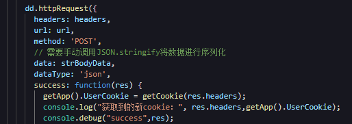
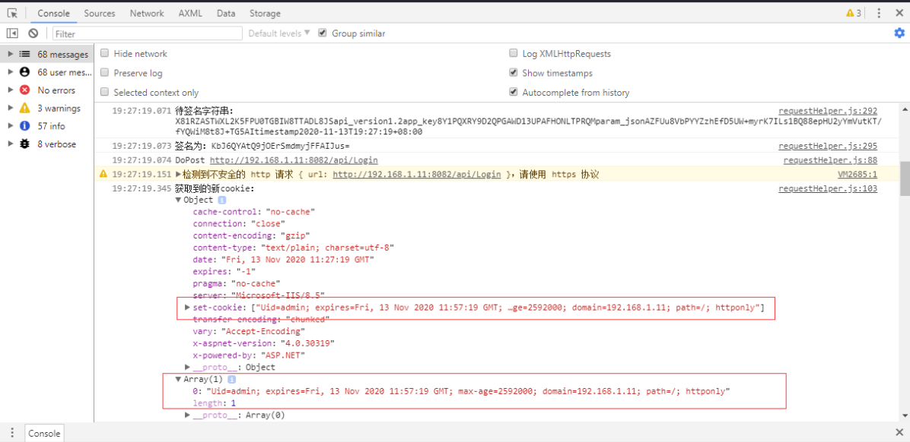
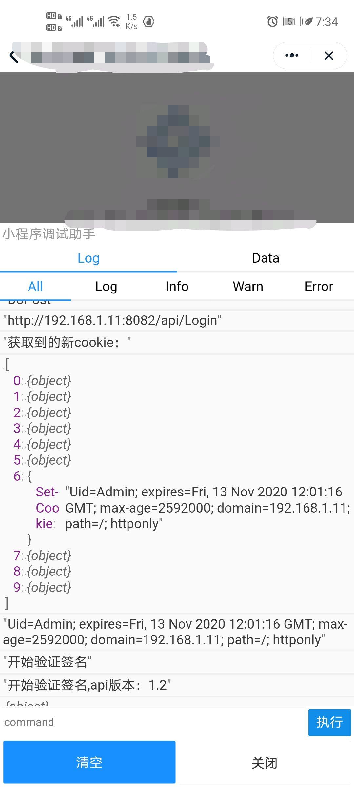

# 钉钉小程序踩坑记录-dd.httpRequest请求头模拟器与真机类型不一致问题

## 模拟器与真机测试获取到的Http请求头类型不一致

### Http请求代码



### 模拟器获取到的Http请求头



模拟器中获取到的请求头为一个对象，可以通过调用对象的属性直接获取到请求头的值，且获取到的Cookie值是数组类型。

### 真机测试获取到的Http请求



可以看到获取的请求头为一个数组，只能通过遍历获取到请求头的值，且获取到的Cookie值是字符串类型。

### 影响

1. 在获取请求头的值时，需要考虑到模拟器与真机中请求头类型不一致问题
2. 真机环境对cookie使用的问题，如果在发起请求时，直接传入获取的cookie字符串，导致服务端获取的cookie字符串为`Uid=admin; expires=Sat, 14 Nov 2020 08:17:47 GMT; max-age=2592000; domain=192.168.1.102; path=/; httponly, Uid=admin`，从而导致服务端获取cookie失败。在模拟器中直接传入获取的cookie数组时，在服务端获取到的cookie字符串为`Uid=admin; expires=Sat, 14 Nov 2020 07:51:06 GMT; max-age=2592000; domain=192.168.1.102; path=/; httponly; Uid=admin`，服务器可以正常获取到cookie。（服务端为ASP.NET WEBAPI。）

这两个字符串值在后面的httponly结尾的分隔符有区别，一个是逗号（`,`）一个是分号（`;`）。

## `HttpRequestHeaders.GetCookies`源码

```C#
public static Collection<CookieHeaderValue> GetCookies(this HttpRequestHeaders headers)
{
    if (headers == null)
    {
        throw Error.ArgumentNull("headers");
    }
    Collection<CookieHeaderValue> collection = new Collection<CookieHeaderValue>();
    IEnumerable<string> enumerable;
    // 获取cookie请求头
    if (headers.TryGetValues("Cookie", out enumerable))
    {
        foreach (string current in enumerable)
        {
            CookieHeaderValue item;
            // 将cookie字符串转成cookie对象
            if (CookieHeaderValue.TryParse(current, out item))
            {
                collection.Add(item);
            }
        }
    }
    return collection;
}
```

`CookieHeaderValue`类中的`TryParse`、`ParseCookieSegment`静态方法：

```C#
public static bool TryParse(string input, out CookieHeaderValue parsedValue)
{
    parsedValue = null;
    if (string.IsNullOrEmpty(input))
    {
        return false;
    }
    // 根据分号拆分字符串，将cookie字符串变成{{key}}={{value}}的字符串数组
    string[] array = input.Split(CookieHeaderValue.segmentSeparator);
    CookieHeaderValue cookieHeaderValue = new CookieHeaderValue();
    string[] array2 = array;
    for (int i = 0; i < array2.Length; i++)
    {
        string segment = array2[i];
        if (!CookieHeaderValue.ParseCookieSegment(cookieHeaderValue, segment))
        {
            return false;
        }
    }
    if (cookieHeaderValue.Cookies.Count == 0)
    {
        return false;
    }
    parsedValue = cookieHeaderValue;
    return true;
}

private static bool ParseCookieSegment(CookieHeaderValue instance, string segment)
{
    if (string.IsNullOrWhiteSpace(segment))
    {
        return true;
    }
    // 根据等号拆分{{key}}={{value}}字符串
    string[] array = segment.Split(CookieHeaderValue.nameValueSeparator, 2);
    if (array.Length < 1 || string.IsNullOrWhiteSpace(array[0]))
    {
        return false;
    }
    string text = array[0].Trim();
    if (string.Equals(text, "expires", StringComparison.OrdinalIgnoreCase))
    {
        string segmentValue = CookieHeaderValue.GetSegmentValue(array, null);
        DateTimeOffset value;
        if (FormattingUtilities.TryParseDate(segmentValue, out value))
        {
            instance.Expires = new DateTimeOffset?(value);
            return true;
        }
        return false;
    }
    else
    {
        if (string.Equals(text, "max-age", StringComparison.OrdinalIgnoreCase))
        {
            string segmentValue2 = CookieHeaderValue.GetSegmentValue(array, null);
            int seconds;
            if (FormattingUtilities.TryParseInt32(segmentValue2, out seconds))
            {
                instance.MaxAge = new TimeSpan?(new TimeSpan(0, 0, seconds));
                return true;
            }
            return false;
        }
        else
        {
            if (string.Equals(text, "domain", StringComparison.OrdinalIgnoreCase))
            {
                instance.Domain = CookieHeaderValue.GetSegmentValue(array, null);
                return true;
            }
            if (string.Equals(text, "path", StringComparison.OrdinalIgnoreCase))
            {
                instance.Path = CookieHeaderValue.GetSegmentValue(array, "/");
                return true;
            }
            if (string.Equals(text, "secure", StringComparison.OrdinalIgnoreCase))
            {
                string segmentValue3 = CookieHeaderValue.GetSegmentValue(array, null);
                if (!string.IsNullOrWhiteSpace(segmentValue3))
                {
                    return false;
                }
                instance.Secure = true;
                return true;
            }
            else
            {
                if (!string.Equals(text, "httponly", StringComparison.OrdinalIgnoreCase))
                {
                    string segmentValue4 = CookieHeaderValue.GetSegmentValue(array, null);
                    bool result;
                    try
                    {
                        FormDataCollection formDataCollection = new FormDataCollection(segmentValue4);
                        NameValueCollection values = formDataCollection.ReadAsNameValueCollection();
                        CookieState item = new CookieState(text, values);
                        instance.Cookies.Add(item);
                        result = true;
                    }
                    catch
                    {
                        result = false;
                    }
                    return result;
                }
                string segmentValue5 = CookieHeaderValue.GetSegmentValue(array, null);
                if (!string.IsNullOrWhiteSpace(segmentValue5))
                {
                    return false;
                }
                instance.HttpOnly = true;
                return true;
            }
        }
    }
}

```

由于通过分号拆分，再通过等号拆分，真机传入的Cookie字符串最后会出现`httponly, Uid`的Key，该Key只满足`if (!string.Equals(text, "httponly", StringComparison.OrdinalIgnoreCase))`这个条件，最后会执行`CookieState item = new CookieState(text, values);`构造函数，该构造函数会对Key做验证，最终调用的的是`FormattingUtilities`类的`ValidateHeaderToken`验证方法，源码为：

```C#
// System.Net.Http.FormattingUtilities
public static bool ValidateHeaderToken(string token)
{
    if (token == null)
    {
        return false;
    }
    for (int i = 0; i < token.Length; i++)
    {
        char c = token[i];
        if (c < '!' || c > '~' || "()<>@,;:\\\"/[]?={}".IndexOf(c) != -1)
        {
            return false;
        }
    }
    return true;
}
```

## 解决方案

```js
  function getCookie(headers){
    if(!headers) return undefined;
    // 模拟器获取cookie的代码
    var cookie = headers["set-cookie"]||headers["Set-Cookie"];

    // 真机获取cookie的代码
    if(headers.length){
      for(let i = 0;i<headers.length;i++){
        var element=headers[i];

        if(element["set-cookie"]){
          cookie = element["set-cookie"];
          break;
        }
        if(element["Set-Cookie"]){
          cookie = element["Set-Cookie"];
          break;
        }
      }
    }

    // 如果获取到的cookie是字符串，则将其转成数组
    if(typeof(cookie)==="string"){
      cookie = [cookie];
    }

    return cookie;
  }
```
